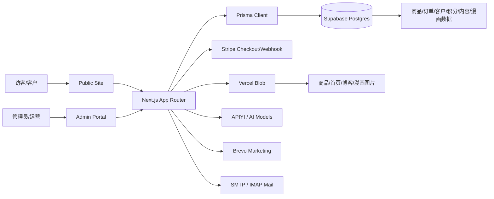
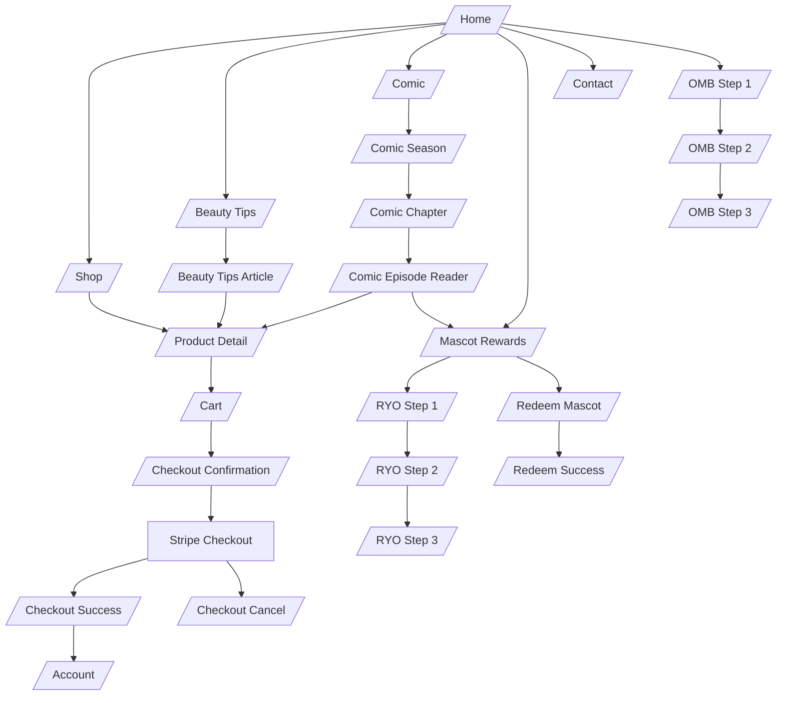
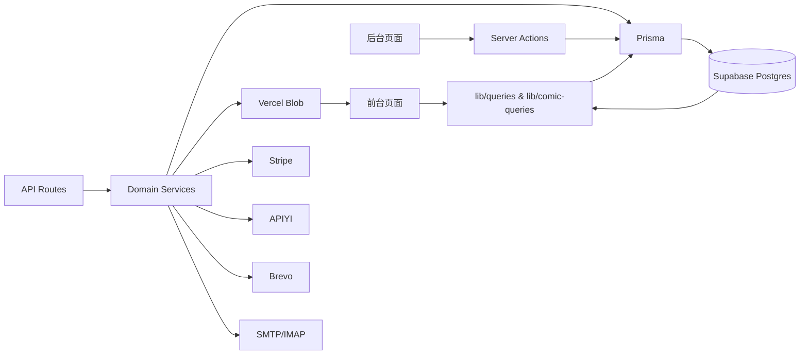
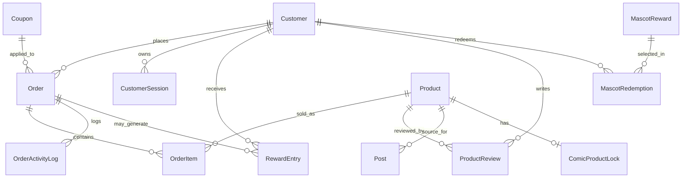
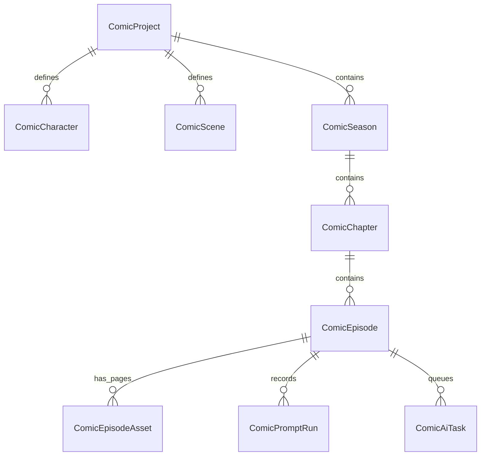
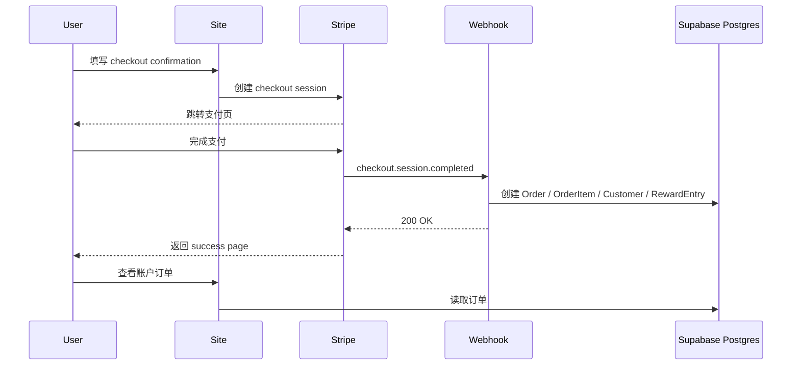
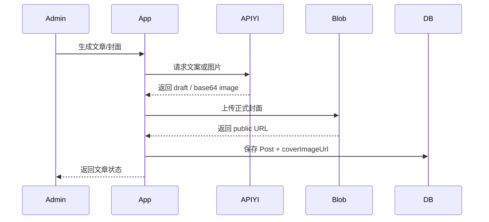
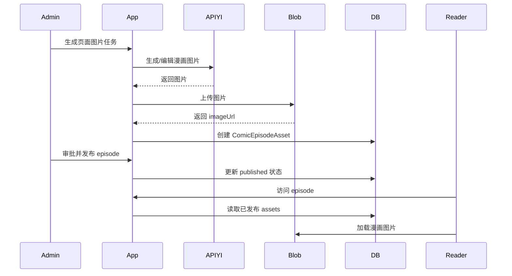

# Neatique Beauty Architecture

版本：v1.0  
日期：2026-06-09  
范围：网站地图、页面关系图、用户旅程、数据结构、导航逻辑

## 1. 架构概览

Neatique Beauty 是一个基于 Next.js App Router 的品牌电商与内容运营系统。前台承担品牌展示、商品销售、内容阅读、账户与积分互动；后台承担商品、订单、评论、活动、奖励、文章、邮件营销和漫画生产管理。



### 核心边界

- 前台页面：以购买转化、SEO 内容、积分活动和漫画阅读为主。
- 后台页面：以运营管理、内容生产、审核和自动化为主。
- 数据库：保存结构化业务数据，不再作为正式大图存储主路径。
- 媒体：正式商品、博客、首页、吉祥物和漫画图片优先走 Vercel Blob。
- 外部服务：Stripe 负责支付，Brevo 负责营销邮件，APIYI 统一负责 AI 文案/图片，SMTP/IMAP 负责邮箱。

## 2. 网站地图

### 2.1 前台站点地图

```text
/
├─ /shop
│  └─ /shop/[slug]
├─ /cart
├─ /checkout
│  ├─ /checkout/confirmation
│  ├─ /checkout/start
│  ├─ /checkout/success
│  └─ /checkout/cancel
├─ /account
│  ├─ /account/login
│  └─ /account/register
├─ /beauty-tips
│  └─ /beauty-tips/[slug]
├─ /comic
│  └─ /comic/[seasonSlug]
│     └─ /comic/[seasonSlug]/[chapterSlug]
│        └─ /comic/[seasonSlug]/[chapterSlug]/[episodeSlug]
├─ /mascot
├─ /rd
│  ├─ /rd/redeem
│  └─ /rd/success
├─ /ryo
│  ├─ /ryo2
│  │  └─ /ryo2/thank-you
│  └─ /ryo3
├─ /om
│  ├─ /om2
│  │  └─ /om2/thank-you
│  └─ /om3
├─ /reviews/[id]
├─ /contact
├─ /privacy-policy
├─ /private-policy
├─ /terms-of-use
├─ /shipping-policy
└─ /return-policy
```

### 2.2 后台站点地图

```text
/admin/login
/admin
├─ /admin/products
│  ├─ /admin/products/new
│  └─ /admin/products/[id]
├─ /admin/reviews
│  └─ /admin/reviews/[slug]
├─ /admin/coupons
│  └─ /admin/coupons/[id]
├─ /admin/orders
├─ /admin/customers
├─ /admin/forms
│  └─ /admin/forms/[formKey]
│     └─ /admin/forms/[formKey]/[id]
├─ /admin/omb-claims
├─ /admin/rewards
│  └─ /admin/rewards/mascots
│     ├─ /admin/rewards/mascots/new
│     └─ /admin/rewards/mascots/[id]
├─ /admin/posts
│  ├─ /admin/posts/new
│  ├─ /admin/posts/[id]
│  └─ /admin/posts/[id]/preview
├─ /admin/email
├─ /admin/email-marketing
│  ├─ /admin/email-marketing/new
│  ├─ /admin/email-marketing/[id]
│  └─ /admin/email-marketing/audience/[audienceType]
├─ /admin/finance
├─ /admin/settings
└─ /admin/comic
   ├─ /admin/comic/project
   ├─ /admin/comic/characters
   │  ├─ /admin/comic/characters/new
   │  └─ /admin/comic/characters/[id]
   ├─ /admin/comic/scenes
   │  ├─ /admin/comic/scenes/new
   │  └─ /admin/comic/scenes/[id]
   ├─ /admin/comic/seasons
   │  ├─ /admin/comic/seasons/new
   │  └─ /admin/comic/seasons/[id]
   ├─ /admin/comic/chapters/[id]
   ├─ /admin/comic/outline-studio
   ├─ /admin/comic/publish-center
   │  └─ /admin/comic/publish-center/chapters/[id]
   ├─ /admin/comic/extra-story-outline
   ├─ /admin/comic/extra-story-publish-center
   ├─ /admin/comic/product-locks
   └─ /admin/comic/image-creation
```

### 2.3 API 与媒体路由

```text
/api
├─ /api/checkout
├─ /api/checkout/clear
├─ /api/cart/clear
├─ /api/stripe/webhook
├─ /api/contact
├─ /api/subscribe
├─ /api/om, /api/om2, /api/om3
├─ /api/ryo, /api/ryo2, /api/ryo3
├─ /api/omb-claims/[id]/image
├─ /api/ryo-claims/[id]/image
├─ /api/comic/episode-download
├─ /api/cron/ai-posts
├─ /api/cron/comic-tasks
├─ /api/cron/follow-emails
└─ /api/admin/*

/media
├─ /media/product/[folder]/[file]
├─ /media/site/[folder]/[file]
├─ /media/post/[id]
├─ /media/comic/[id]
├─ /media/comic-creation/[id]
└─ /media/comic-product-lock/[id]
```

说明：`/media/*` 是历史和 fallback 路由；正式大图应优先使用 Vercel Blob URL。

## 3. 页面关系图

### 3.1 前台页面关系



### 3.2 后台页面关系

```mermaid
flowchart TD
  Login[/Admin Login/] --> Dashboard[/Admin Dashboard/]
  Dashboard --> Products[/Products/]
  Dashboard --> Orders[/Orders/]
  Dashboard --> Customers[/Customers/]
  Dashboard --> Reviews[/Reviews/]
  Dashboard --> OMB[/OMB Claims/]
  Dashboard --> Rewards[/Points & Rewards/]
  Dashboard --> Posts[/Posts/]
  Dashboard --> EmailMarketing[/Email Marketing/]
  Dashboard --> ComicAdmin[/Comic Admin/]
  Dashboard --> Finance[/Finance/]
  Dashboard --> Settings[/Settings/]

  Products --> ProductEdit[/Product Edit/]
  Products --> Coupons[/Coupons/]
  Reviews --> ReviewProduct[/Reviews By Product/]
  Orders --> OrderRows[Order Update Actions]
  OMB --> FollowEmail[Follow Email Settings]
  Rewards --> Mascots[/Mascot Settings/]
  Rewards --> Redemption[Redemption Review]
  Posts --> PostEdit[/Post Edit/]
  Posts --> AiPosts[AI SEO Posts]
  EmailMarketing --> Audience[Audience Sync]
  EmailMarketing --> Campaigns[Campaigns]
  Settings --> EmailInbox[/Email Inbox/]

  ComicAdmin --> ProjectBible[/Project Bible/]
  ComicAdmin --> Characters[/Characters/]
  ComicAdmin --> Scenes[/Scenes/]
  ComicAdmin --> OutlineStudio[/Outline Studio/]
  ComicAdmin --> PublishCenter[/Publish Center/]
  ComicAdmin --> ExtraStory[/Extra Story/]
  ComicAdmin --> ProductLocks[/Product Locks/]
  ComicAdmin --> ImageCreation[/Image Creation/]
```



### 3.3 数据流关系



## 4. 用户旅程

### 4.1 购买旅程

```text
入口：首页 / Shop / Beauty Tips / 外部广告
  -> 浏览商品列表
  -> 打开商品详情
  -> 查看图集、价格、库存、评价
  -> 加入购物车
  -> 购物车确认
  -> 填写美国收货地址
  -> Stripe Checkout 支付
  -> 支付成功页
  -> 订单写入数据库
  -> 用户可在 Account 查看订单
```

关键数据：

- `Product` 提供商品内容、库存、价格和图片。
- `Order` 和 `OrderItem` 保存支付后的订单快照。
- `Customer` 关联账户、订单和积分。
- `RewardEntry` 记录购买或运营动作产生的积分。

### 4.2 内容种草旅程

```text
搜索引擎 / 首页 / 导航
  -> Beauty Tips 列表
  -> 文章详情
  -> 阅读护肤知识、成分说明和 routine 建议
  -> 点击相关商品或 Shop
  -> 商品详情
  -> 加购/结账
```

关键数据：

- `Post` 保存文章、SEO 信息、封面和发布状态。
- `Product` 可作为文章的 source product。
- sitemap 自动暴露已发布文章和 active products。

### 4.3 会员积分与 mascot 旅程

```text
用户访问 Mascot Rewards
  -> 了解 TikTok follow 和 RYO 获取积分规则
  -> RYO 注册订单
  -> 后台审核并发放积分
  -> 用户积分达到 1000
  -> 进入 /rd 选择 mascot
  -> 提交兑换地址
  -> 后台处理 redemption
```

关键数据：

- `Customer.loyaltyPoints` 表示当前积分余额。
- `RewardEntry` 记录积分发放、兑换和调整。
- `MascotReward` 定义可兑换吉祥物。
- `MascotRedemption` 保存兑换申请和履约状态。
- `RyoClaim` 保存订单注册和奖励审核信息。

### 4.4 OMB 活动旅程

```text
用户进入 OMB Step 1
  -> 输入平台、订单号、姓名、邮箱
  -> Step 2 填写购买产品、评分、评论
  -> Step 3 上传证明、填写 extra bottle 地址
  -> 后台审核
  -> 运营更新 gift sent 状态
  -> follow email 根据阶段提醒
```

关键数据：

- `OmbClaim` 保存 claim 主数据、证明和发货状态。
- `FollowEmailLog` 记录跟进邮件。
- `Product` 提供可选择的购买产品。

### 4.5 Comic 阅读旅程

```text
用户进入 /comic
  -> 选择 season
  -> 选择 chapter
  -> 打开 episode
  -> 阅读漫画页面
  -> 可能跳转产品、mascot 或品牌内容
```

关键数据：

- `ComicSeason`、`ComicChapter`、`ComicEpisode` 决定阅读层级。
- `ComicEpisodeAsset` 保存页面图片 URL、排序、发布状态。
- 已发布条件：season、chapter、episode、asset 都必须 published。

### 4.6 后台运营旅程

```text
管理员登录
  -> Dashboard 查看概览
  -> Products 管理商品和库存
  -> Orders 更新状态和物流
  -> Reviews 审核评论
  -> Posts 发布文章或 AI 生成文章
  -> OMB / Rewards 审核活动和积分
  -> Comic 管理内容生产
  -> Email Marketing 同步受众和发送活动
```

关键机制：

- Admin 路由需要 full admin session。
- 修改数据后触发 revalidatePath/revalidateTag。
- 长任务通过 API route、cron 或 task queue 处理。

## 5. 数据结构

### 5.1 业务域划分

```text
Commerce
  Product, Order, OrderItem, OrderActivityLog, Coupon

Identity & Loyalty
  Customer, CustomerSession, RewardEntry, MascotReward, MascotRedemption

Content & Marketing
  Post, FormSubmission, EmailContact, EmailCampaign, MailboxReplyExample

Review & Campaign Claims
  ProductReview, OmbClaim, RyoClaim, FollowEmailLog

Comic Studio
  ComicProject, ComicCharacter, ComicScene, ComicSeason, ComicChapter,
  ComicEpisode, ComicEpisodeAsset, ComicPromptRun, ComicAiTask,
  ComicImageCreation, ComicProductLock

Settings & Finance
  StoreSetting, FinancePaymentDetail
```

### 5.2 核心 ER 图





### 5.3 关键表说明

| 表 | 作用 | 页面/流程 |
| --- | --- | --- |
| Product | 商品主数据 | Shop、PDP、Admin Products、Checkout |
| Order | 订单主数据 | Checkout、Account、Admin Orders |
| OrderItem | 订单行快照 | Checkout、Account、Admin Orders |
| Customer | 客户账户 | Account、Reviews、Rewards |
| ProductReview | 商品评价 | PDP、Reviews、Admin Reviews |
| Post | SEO 文章 | Beauty Tips、Admin Posts |
| OmbClaim | OMB 活动 | /om 系列、Admin OMB |
| RyoClaim | RYO 活动 | /ryo 系列、Admin Rewards |
| RewardEntry | 积分流水 | Account、Admin Rewards |
| MascotReward | 吉祥物目录 | /mascot、/rd、Admin Rewards |
| MascotRedemption | 吉祥物兑换 | /rd、Admin Rewards |
| ComicEpisodeAsset | 漫画页面图片 | Comic Reader、Publish Center |
| EmailCampaign | 邮件活动 | Admin Email Marketing |
| FormSubmission | 表单统一收集 | Contact、Subscribe、Admin Forms |

### 5.4 媒体数据策略

```text
正式图片主路径：
  Vercel Blob URL

兼容/fallback 路径：
  /media/product/[folder]/[file]
  /media/site/[folder]/[file]
  /media/post/[id]
  /media/comic/[id]

映射文件：
  data/vercel-blob-media-manifest.generated.ts

迁移脚本：
  npm run media:migrate-blob -- --apply
  npm run comic:migrate-images -- --apply
```

原则：

- 正式商品、首页、博客、吉祥物、漫画图片不应长期存入 Postgres base64 字段。
- 数据库保留图片 URL、mime、storage key、byte size、sha 等元数据。
- 未审批预览图或历史 fallback 可以短期使用数据库字段，但发布后应上传 Blob 并清空正式大字段。

## 6. 导航逻辑

### 6.1 前台主导航

来自 `siteConfig.nav`：

```text
Home -> /
Shop -> /shop
Comic -> /comic
Beauty Tips -> /beauty-tips
Contact -> /contact
```

导航目标：

- Home 承接品牌认知和主要入口。
- Shop 承接购买意图。
- Comic 承接品牌内容和 IP 复访。
- Beauty Tips 承接 SEO 和教育内容。
- Contact 承接咨询和表单线索。

### 6.2 Footer 导航

Footer 分为三组：

```text
Shop
  All Products
  重点商品快捷入口

Discover
  Comic
  Beauty Tips
  Mascot Rewards
  Contact Us
  Cart
  My Account

Policies
  Privacy Policy
  Terms of Use
  Shipping Policy
  Return Policy
```

Footer 目标：

- 给低意图用户提供探索路径。
- 给购买用户提供政策和账户入口。
- 给 SEO 爬虫提供稳定的内部链接。

### 6.3 商品导航逻辑

```text
/shop
  -> 只展示 status = ACTIVE 的商品
  -> 按 featured 和 createdAt 排序
  -> 点击卡片进入 /shop/[slug]

/shop/[slug]
  -> slug 查 Product
  -> 展示 Product.galleryImages
  -> 展示 published reviews
  -> 加入购物车
```

加购后：

```text
Product Detail -> Cart -> Checkout Confirmation -> Stripe -> Success/Cancel
```

### 6.4 账户导航逻辑

```text
未登录访问 /account
  -> 引导登录或注册

已登录访问 /account
  -> 展示订单、积分、评论、可评论商品
```

登录状态由 customer session cookie 和 `CustomerSession` 记录共同决定。

### 6.5 活动导航逻辑

OMB：

```text
/om
  -> 创建或匹配 OmbClaim
  -> redirect /om2?id=...
/om2
  -> 填写产品、评分、评论
  -> redirect /om3?id=...
/om3
  -> 上传证明、填写地址
  -> 完成 claim
```

RYO：

```text
/ryo
  -> 创建或匹配 RyoClaim
  -> redirect /ryo2?id=...
/ryo2
  -> 注册订单信息
  -> redirect /ryo3?id=...
/ryo3
  -> 提交证明/最后步骤
  -> 后台审核积分
```

Mascot redeem：

```text
/mascot
  -> /rd
  -> /rd?mascot=[slug]
  -> /rd/redeem
  -> /rd/success
```

### 6.6 Comic 导航逻辑

公共端只显示已发布内容：

```text
ComicSeason.published = true
ComicChapter.published = true
ComicEpisode.published = true
ComicEpisodeAsset.published = true
```

路径层级：

```text
/comic
  -> seasons
/comic/[seasonSlug]
  -> chapters
/comic/[seasonSlug]/[chapterSlug]
  -> episodes
/comic/[seasonSlug]/[chapterSlug]/[episodeSlug]
  -> reader assets
```

语言逻辑：

- 英文页面优先读取 PAGE / EXTRA_PAGE assets。
- 中文页面扩展读取 CHINESE_PAGE assets。
- 如果目标语言缺少完整 required pages，则对应语言 episode 不应展示。

### 6.7 后台导航逻辑

后台导航来自 `siteConfig.adminNav`，分为运营模块：

```text
Dashboard
Products
OMB Claim
Forms
Orders
Finance
Users
Points & Rewards
Posts
Comic
Email Marketing
Settings
```

权限：

- `/admin/login` 对未登录用户开放。
- `/admin/*` dashboard 路由需要 full admin session。
- Server Actions 和 Admin API route 在执行前再次校验 admin session。

后台跳转规则：

- 创建/更新成功后 redirect 回列表或详情页，并带 status query。
- 审核/发布类操作后触发 `revalidatePath`，保证前台内容更新。
- Comic 发布后重建相关 season/chapter/episode 路径缓存。
- 邮件、AI、cron 和导出操作通过 API route 或后台 action 返回状态。

### 6.8 SEO 与系统导航

```text
/sitemap.xml
  -> 首页、固定页面、active products、published posts、comic 页面

/robots.txt
  -> 允许前台抓取
  -> 禁止 /admin 和 /api
```

SEO 规则：

- 公开页面应设置 metadata、canonical、Open Graph。
- 商品和文章应进入 sitemap。
- 未发布内容、后台页面、API 不应进入搜索索引。

## 7. 关键流程时序

### 7.1 Stripe 下单流程



### 7.2 AI 博客封面发布流程



### 7.3 Comic 页面发布流程



## 8. 架构约束与维护规则

- 不要把正式大图长期写入 Postgres base64 字段。
- 新增公开图片时优先上传 Vercel Blob，并更新 manifest 或数据库 URL。
- 新增公开页面时补 metadata、canonical 和 sitemap 逻辑。
- 新增后台写操作时必须校验 admin session。
- 修改商品、文章、漫画发布状态后必须 revalidate 对应前台路径。
- Stripe webhook 必须幂等，避免重复创建订单或重复扣库存。
- AI 生成内容必须保留审核/审批步骤，避免未经确认直接影响公开页。
- OMB/RYO 页面应保持用户路径简单，不暴露内部处理状态。
- 数据库查询默认避免 select 大字段，除非媒体 fallback 路由或下载功能确实需要。
